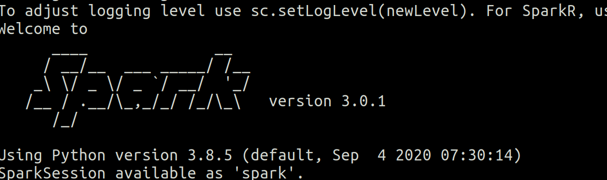

# 1-Introducción

0. [Info en el shell](#schema0)
1. [Primeros pasos](#schema)
2. [Primera ejecución del contador](#schema2)

# 0. INFO en el shell
~~~python
spark = SparkSession.builder.getOrCreate()
spark.sparkContext.setLogLevel("ERROR")

conf = SparkConf().setMaster("local").setAppName("RatingsHistogram")
sc = SparkContext(conf = conf)
sc.setLogLevel("ERROR") 
~~~

# 1. Primeros pasos
1º  Crear entorno con Conda para trabajar con pyspark:

          
 ~~~ python
conda create --name spark-course python=3.8
~~~
spark-course = nombre del entorno
python = 3.8, versióm de python para el entrono.

2ª Activar el entorno
~~~ python
conda activate spark-course
~~~

2º Instalar pyspark  y openjdk
~~~ python
conda install pyspark openjdk

~~~

3º Comprobamos que se ha instalado correctamente entrando el promt de spark
~~~ 
(spark-course) ➜  ~ pyspark
~~~ 

# 2. Primera ejecución del contador
Hemos tenido que cambiar la ruta de los datos. En el archivo original aparecía así :
~~~ python
lines = sc.textFile("file:///SparkCourse/ml-100k/u.data")
~~~
Y nosotros hemos tenido que ponerlo así:
~~~ python
lines = sc.textFile("./ml-100k/u.data")
~~~
Simplemente porque nuestra ruta hacia los datos es distinta.

~~~ python
(spark-course) ➜  ~ spark-submit ratings.counter.py
~~~